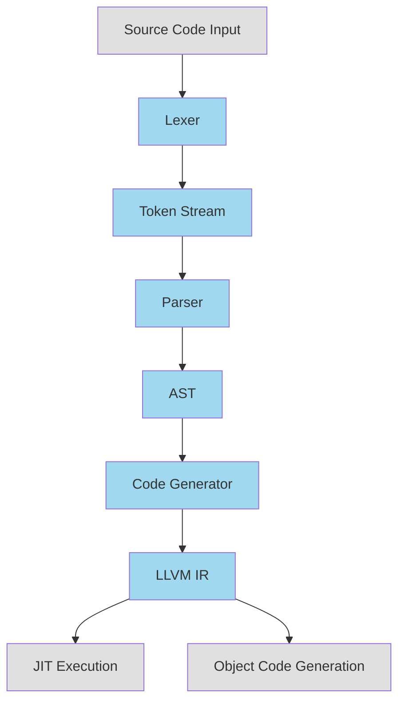

# Architecture Analysis

## Status
Initial architecture analysis complete

## Last Updated
2026-09-03T00:19:00Z

## Analyzed Git Revision
e264748

## Confidence Level
High

## Scope
Detailed architecture and component analysis of CussinLang

## Project Summary
CussinLang is a C++17-based compiler implementation for a custom programming language. It features a hand-written lexer, recursive-descent parser, AST-based intermediate representation, and LLVM-backed code generator/JIT.

## Major Findings

### Core Components and Architecture

1. **Lexer (`src/lang/lexer.cpp/.h`)**:
   - Tokenizes source text into `Token`/`TokenType` values
   - Handles identifiers, literals (digits, strings, floats), operators, and keywords
   - Contains a comprehensive list of token types including struct, enum, modifiers, and function keywords

2. **Parser (`src/lang/parser.cpp/.h`)**:
   - Recursive-descent parser that builds an Abstract Syntax Tree (AST)
   - Uses an operator-precedence table (`src/utils/BinopPrecedence.h`) for binary expressions
   - Parses various expression types: primary expressions, binary operations, function calls, if/for/let expressions, and scope expressions

3. **AST (`src/lang/ast/`)**:
   - Expression/statement node types including binary, unary, call, for, if, let, function, prototype, return, scope, struct, string, number, and variable expressions
   - Each AST node has corresponding header files in `src/lang/ast/headers/`
   - Implements visitor pattern for AST traversal

4. **Code Generation (`src/llvmstuff/`)**:
   - LLVM IR code generator using symbol table and scope manager
   - Implements a visitor (`CodegenVisitor.h`/`CodegenVisitor.cpp`) that walks the AST and emits LLVM IR
   - Uses `ModuleManager.h`, `ContextManager.h`, and `ScopeManager.h` for managing LLVM components

5. **JIT (`src/jit/CussinJIT.h`)**:
   - LLVM ORC-based JIT execution support
   - Currently commented out in the main entry point

### Data Flow and Control Flow

1. **Compilation Pipeline**:
   - Source text input → Lexer → Token stream → Parser → AST → Code Generator → LLVM IR → JIT/Execution

2. **Key Components Interactions**:
   - `CussingLangImpl.cpp` orchestrates the entire process
   - Main loop processes test inputs or interactive input
   - Lexer converts input into tokens
   - Parser builds AST from tokens
   - Code generator walks AST to produce LLVM IR
   - JIT executes the generated code

### Architecture Diagram

## Next Steps
1. Analyze the quality of implementation
2. Investigate the build and testing setup
3. Review the project's documentation and user interface
4. Examine the error handling and debugging mechanisms